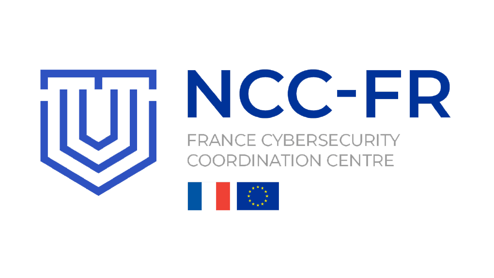

# Zero Trust Infrastructure As Code (ZTIAC)

Zero Trust Infrastructure-as-Code is a Terraform/OpenTofu project that provides a collection of reusable modules and templates to easily deploy secure cloud infrastructures on SecNumCloud-certified providers (currently Outscale).

## Features

This project includes:

- A [VPC](./modules/outscale/vpc/README.md) Module: Simplifies the deployment of virtual public and private networks with NAT and internet gateways and is compatible with advanced configurations like peering.
- A [Compute](./modules/outscale/compute/README.md) Module: Manages virtual machine deployments, supporting configurations like [OpenPubkey SSH](https://github.com/openpubkey/opkssh) for secure access and reverse proxy setups with [Caddy](https://caddyserver.com) or Zero Trust Network Access setup with [Chimere](https://chimere.eu).
- Templates: Detailed infrastructure examples, including multi-tier architectures, to illustrate real-world deployment scenarios.

## Getting Started
### Requirements
Before deploying any template, ensure you have the following:

- Terraform version >= 1.0 or Opentofu
- Access to the Outscale cloud platform
- Valid Outscale API credentials

### Deployment Steps

To deploy one of the templates do the following:

1. Clone the Repository:
```bash
git clone https://github.com/chimere-eu/ztiac.git
cd ztiac/templates/outscale/vpc-with-nat
# For this example we chose vpc-with-nat but it would be the same for every other template
```
2.  Prepare your environmet:
      - Create a `terraform.tfvars` file with necessary credentials and variables.
3. Initialize Terraform:
```bash
terraform init
```
4. Preview and Deploy:
```bash
# Run terraform plan to see the execution plan
terraform plan
# Apply your desired template with terraform apply
terraform apply
```
5. Cleanup:
     -  To remove deployed resources, execute `terraform destroy`.

## Contribute
We welcome contributions from the community! To contribute, please fork the repository, create a new branch for your changes, and submit a pull request. Make sure to follow our coding standards and include clear documentation for any new features or modules. For major changes, please open an issue first to discuss your proposed modifications. All contributions are reviewed for quality and security before being merged.

For detailed guidelines on contributing, please refer to our [CONTRIBUTING.md](CONTRIBUTING.md) file.


## Security
If you discover a security vulnerability or have concerns regarding the security of this project, please report it responsibly by emailing us at [security@chimere.eu](mailto:security@chimere.eu). Do not disclose security issues publicly until they have been reviewed and addressed. We appreciate your help in keeping this project and its users safe.

___

FR: _Ce projet, lauréat de l'appel à projet « Soutien aux PME et startups pour renforcer leurs compétences dans le domaine de la cybersécurité » du NCC-FR Cyber et de la Bpifrance, a été cofinancé par l'Etat dans le cadre de France 2030 et a été cofinancé par l'Union Européenne._

EN: _This project, winner of the call for projects “Support for SMEs and startups to strengthen their skills in the field of cybersecurity” by NCC-FR Cyber and Bpifrance, was co-funded by the French State under the France 2030 program and co-funded by the European Union._

<p float="left">
<picture>
  <source media="(prefers-color-scheme: dark)" srcset="docs/images/EN_Co-fundedbytheEU_RGB_NEG.png">
  <source media="(prefers-color-scheme: light)" srcset="docs/images/EN_Co-fundedbytheEU_RGB_POS.png">
  
</picture>
&nbsp;
<picture>
  <source media="(prefers-color-scheme: dark)" srcset="docs/images/Logotype-blanc.png">
  <source media="(prefers-color-scheme: light)" srcset="docs/images/Logotype-rouge-bleu.png">
  
</picture>
&nbsp;
<picture>
  <source media="(prefers-color-scheme: dark)" srcset="docs/images/NCC-FR_logo_2-2.PNG">
  <source media="(prefers-color-scheme: light)" srcset="docs/images/NCC-FR_logo_2-2.PNG">
  
</picture>
&nbsp;
<picture>
  <source media="(prefers-color-scheme: dark)" srcset="docs/images/Logo_Bpifrance.svg">
  <source media="(prefers-color-scheme: light)" srcset="docs/images/Logo_Bpifrance.svg">
  
</picture>
</p>
